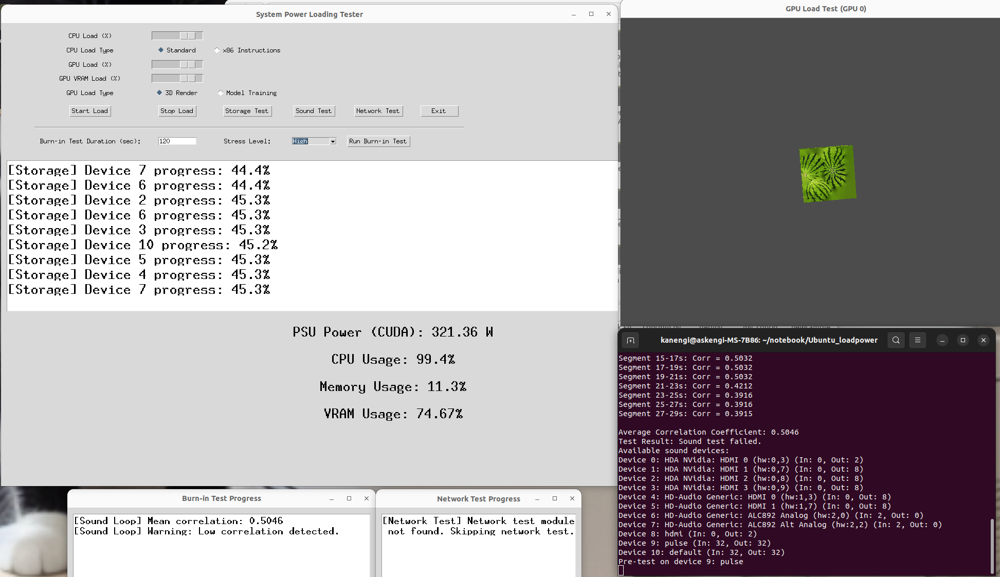

# rocmcuda-powerloader
## Based on the Ubuntu_loadpower 
- Compliant with CUDA and ROCm

> [!WARNING]
> This is still proto type version. And continously revising the each function
> You may not execute by your expected.

> [!NOTE]
> CUDA tested version is 12.2.
> ROCm tested version is 6.10.5 
  
# Call main gui menu

```
python s_bench/main.py

```




# install tree

- Cosidering execute python script in the root directory
- GUI Menu is displayed several stress menu


```

├── "root directory"
│   
├── s_bench
│   ├── cpu_load
│   │   └── __pycache__
│   ├── gpu_load
│   │   └── __pycache__
│   ├── network_test
│   │   └── __pycache__
│   ├── old_version
│   ├── sound_test
│   │   └── __pycache__
│   ├── storage_load
│   │   └── __pycache__
│   └── system_info
│       └── __pycache__

```

# installation
- clone repository after move test scripts or using this shell script
```
chmod +x   create_directory.sh
chmod +x   create_directory_init.sh
./create_directory.sh
./create_directory_init.sh
```

# Function
- CPU stress
   - normal
   - x86  
- GPU power stress
   - Drawing 3D
   - model training

- storage(USB port) test
- Network test
- Sound loopback
- All in one test (burn-in mode)


  

# For Japanese 
- Please refer to below article

https://zenn.dev/manyan3/articles/3c642af10af0fc
